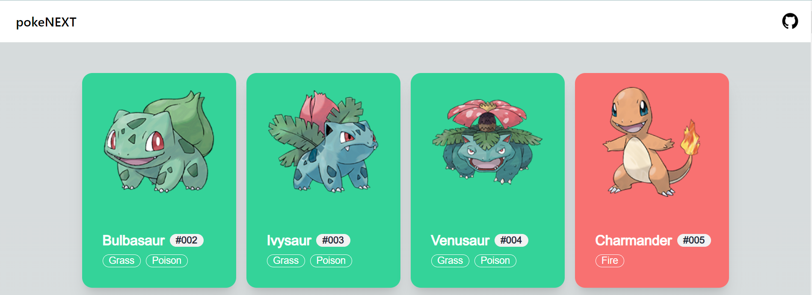
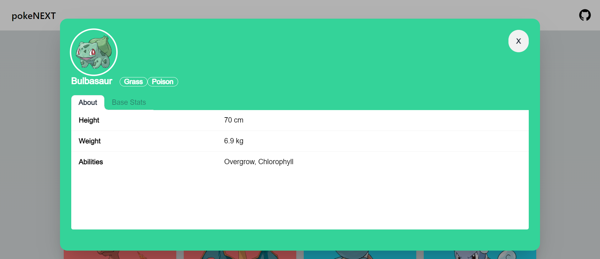
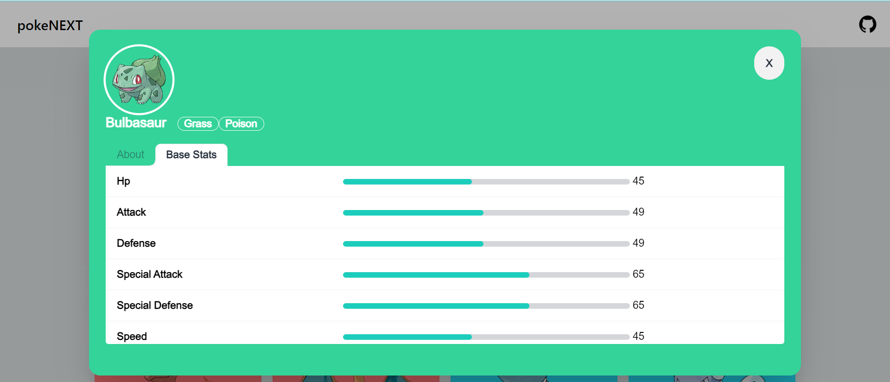

# pokeNEXT

A Pokedex created using [PokeAPI](https://pokeapi.co/docs/v2), [NextJS](https://nextjs.org/), [daisyUI](https://daisyui.com/)

# Instalation
1. NodeJs v18.16.0
2. npm
3. `git clone https://github.com/fahmipotlot/pokenext`
4. `cd pokenext`
5. `npm install`
6. `npm run dev`